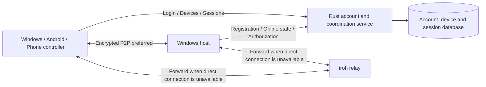

**English** | [简体中文](PROJECT_DESIGN.zh-CN.md)

<a id="遥舟远程桌面项目设计草案"></a>

# FarSail: Remote Desktop Project Design Draft

Status: design draft, 2026-09-28. Not yet implemented; performance has not been verified.

<a id="名称与定位"></a>

## Name and Positioning

- **Chinese name: 遥舟; English name: FarSail**. The name evokes sailing into the distance and connecting remote devices across distances.
- The repository and internal program codename are provisionally `farsail`. Formal trademark and domain checks will be completed before public release.
- First-version product scope: account registration/login, client device registration and binding, and account/device management. After login, users can view all remotely accessible devices under the same account and start remote control or file transfer. Windows, Android, and iPhone serve as controllers, with Windows as the controlled device. Remote viewing and control work across networks, preferring direct P2P connections and using a relay when direct connections fail. Support includes multiple monitors, quality switching, bandwidth limits, and bidirectional file transfer. Validate accounts, devices, and the Windows core first, then integrate the two mobile platforms.
- The first version uses temporary invitations and confirmation on the controlled device for each connection. Unattended access, audio, and macOS/Linux desktop clients are deferred to later versions. The user has explicitly specified that mobile devices first control computers, with phones becoming controlled devices later; Android and iOS capabilities will be delivered separately according to their system interfaces.

<a id="图标资产"></a>

## Icon Assets

The current icon candidate is [FarSail v2](assets/branding/farsail-icon-master-v2.png), combining an abstract folded sail, an open window, and connection endpoints. Original images and Windows/Android/iOS icon sizes are stored in `assets/branding/`. The first two-sail boat remains a historical draft because its overall visual composition was close to an application found during research. See the [icon notes](assets/branding/README.md) for sources, generation prompts, and limited similarity checks. Uniqueness is not currently claimed; the icon has not yet been integrated into or released with a client.

<a id="用户流程"></a>

## User Flow

1. The user registers and signs in. The client generates a device identity, then registers with the server and binds to the account after initial confirmation. “My Devices” shows its name, platform, controller/controlled capabilities, online status, and last online time.
2. The controller selects “Remote Control” or “File Transfer” from its own device list. Temporary assistance for someone else uses a device ID and a short-lived invitation passcode. The controlled device displays the requesting account/device, requested permissions, and verification phrase, and separately approves viewing, control, or file access. Devices bound to the same account still require confirmation for each connection in the first version.
3. An established session displays its connection path (direct/relay), latency, bitrate, current monitor, and quality preset. The controller can switch between a single monitor and a multi-monitor overview.
4. Users can transfer files during remote control or establish a file-only session. The controlled device displays sharing and transfer status and can revoke individual permissions or end every connection. Session authorization expires after disconnection; reconnecting requires confirmation again. File resumption reuses only verified content progress, never expired authorization.

<a id="架构与边界"></a>

## Architecture and Boundaries



- **Desktop application**: a Tauri 2 + TypeScript frontend handles the UI; the Rust core handles capture, encoding, input injection, session state, and network transport. Tauri commands handle low-frequency operations, and Channels carry high-frequency data/status streams; video frames do not use ordinary event broadcasts.
- **Mobile applications**: the proposed approach uses Tauri 2 Android/iOS targets to reuse Rust session and transport modules, with a separately adapted touch UI. Platform plugins provide hardware decoding and video display: Kotlin for Android and Swift for iOS. Tauri mobile builds, iroh connections on physical devices, and composition of native video views must be validated before the mobile stack is finalized. A UI framework supporting phones does not establish adequate video performance.
- **Account and coordination service**: a modular Rust monolith includes account authentication, device registration/binding, online status, temporary invitations, session authorization, management APIs, and auditing. Axum + PostgreSQL is recommended. The database stores ownership and grants, while a separate state module manages online connections. Separate business services are unnecessary initially. This service does not receive screen images or input events.
- **Connection layer**: prefer encrypted QUIC connections through iroh. A connection may initially go through a relay, then probe and migrate to a direct path; if direct connectivity fails, it continues through the relay. Deploy the relay as an independent Rust service using the existing `iroh-relay`, avoiding a custom NAT traversal protocol. Clients clearly display the current path.
- **Identity**: a user account identifies the owner, and a long-term device key generated locally by the client identifies the device. The server stores accounts, device public keys, bindings, and short-lived address information; private keys remain in local secure storage. Invitation passcodes are single-use and short-lived, and the controlled device confirms each connection locally. End-to-end connection identity is bound to account authorization or an invitation, with a verification phrase both sides can compare to detect identity substitution during initial pairing.
- **Version boundary**: the network protocol carries major/minor versions and capability negotiation. Older clients receive only resolutions, codecs, and input capabilities supported by both parties.

<a id="账号管理与客户端注册"></a>

## Account Management and Client Registration

<a id="用户与管理员功能"></a>

### User and Administrator Features

| Module                  | First-version design                                                                                                                                                                                                                |
| ----------------------- | ----------------------------------------------------------------------------------------------------------------------------------------------------------------------------------------------------------------------------------- |
| Accounts                | Recommended: email + password registration/login, email verification, password changes/recovery, and logout; the server can allow public registration or administrator invitations                                                  |
| My Devices              | Show all remotely accessible devices under the same account; device names, platform/role, online/offline state, last online time, remote-control/file capabilities, and unbinding; mobile devices initially register as controllers |
| Login management        | View login sessions and recent activity, terminate a selected login, and log out other devices; display login sessions separately from bound devices                                                                                |
| Remote-control sessions | List current connections and recent connection history; request, cancel, and disconnect sessions; clearly distinguish view-only and control permissions                                                                             |
| File transfer           | Start independently from a device card or open during remote control; bidirectional transfer, progress, pause/cancel, and authorized resumption                                                                                     |
| Temporary assistance    | Signed-in users can request access to devices owned by other accounts using short-lived invitations without changing ownership. All first-version controllers must sign in; anonymous guests require separate design                |
| Administrator console   | Manage user enablement, registration policy, invitations, device revocation, and session audits; platform administration does not automatically grant screen-reading or device-control permissions                                  |

“Later unattended access” is a separate device policy. It must not be enabled by default merely because accounts match or a user is signed in. Permitted conditions, trusted controllers, and stronger authentication must be configured locally on the controlled device and validated separately.

<a id="同账号设备列表"></a>

### Device List for the Same Account

- After Windows, Android, and iPhone sign in to the same account, they read consistent server-side device ownership. By default, list every bound device capable of being controlled or providing file services, including offline devices. Keep offline devices and devices with remote access currently disabled in the list, with the reason shown.
- Support name search and online-status/capability filters. Pagination is allowed, but the list must not be limited to recently connected devices or devices on the current LAN. Phones with only a controller role remain in login/device management and must not be mislabeled as remotely controllable phones in phase one.
- Device cards contain name, platform, online status, last online time, and available actions. Recheck online status and permissions before connecting; buttons in a cached list cannot substitute for actual authorization.
- APIs filter ownership using the current signed-in identity. Counts, searches, pagination, and status subscriptions follow the same boundary. Another account’s device ID cannot be used to read its metadata; temporary assistance uses a separate invitation authorization flow.
- Unbinding, disabling, and device state changes synchronize to all clients. Clear the account’s UI cache on logout/account switching so the previous account’s device list cannot remain in a new account session.

<a id="注册绑定与上线"></a>

### Registration, Binding, and Going Online

1. Server authentication establishes the user’s current login session. The client generates a device key pair locally and stores its private key in system secure storage. The server determines ownership from the authenticated context, never trusting an owner ID in the request body.
2. The server issues a single-use device-registration challenge. The client signs it to prove private-key possession, and the server verifies the signature before binding. The challenge is bound to the account, operation, device public key, and expiration, and cannot be consumed twice.
3. A device identity has only one valid owner at a time. Binding writes use database uniqueness constraints and transactions. Repeated registration requests are idempotent; another account cannot override ownership simply by submitting the same device ID. Account changes require explicit unbinding/rebinding. A new identity after reinstallation does not automatically inherit old permissions.
4. The client receives a device credential usable only for its own online registration, heartbeats, and session negotiation. It cannot manage the account or list other devices. A device ID is an identifier, not a password; IP and NAT addresses are mutable, temporary connection information.
5. Authenticated connections and heartbeat leases determine online status; timeouts mark the device offline. Connection generations distinguish reconnects. Once a new connection is online, a disconnect event from the old connection must not incorrectly mark the new one offline.

<a id="账号会话与远控授权"></a>

### Account Sessions and Remote-control Authorization

- Login sessions use short-lived access credentials and refresh credentials that can be rotated and revoked. The database stores only the digest needed to verify refresh tokens. Rust/native code manages client credentials; they do not go into WebView localStorage. Passwords use Argon2id with independent random salts; implementation parameters will be calibrated to server resources and current recommendations.
- Registration verification and password recovery use expiring, single-use tokens, and recovery/login endpoints have rate limits. Password changes, account recovery, and account disabling revoke affected login sessions and remote-control grants. Disabling an account also prevents its devices from renewing online-status and authorization leases.
- Initially, first-party accounts can sign in through a TLS authentication API. Future third-party OAuth/OIDC integration uses the system browser and Authorization Code + PKCE, without embedding long-term client secrets in the application. MFA/passkey APIs and recovery states are reserved for future improvements and are not claimed as implemented.
- For a remote-control request, the server checks account status, initiating/target device identities, bindings or a valid invitation, and the target device’s current policy. The controlled device checks again and approves locally. Issued short-lived grants bind the session ID, both device public keys, requesting user, permissions, single-use nonce, and expiration.
- The iroh transport handshake verifies device identity; the application protocol separately verifies account permissions. P2P and relay paths apply the same authorization checks. Bypassing the coordination API and using a known Endpoint ID must never start capture or input injection.
- Active remote-control/file grants renew through short leases. On a server revocation event, the controlled device immediately stops the corresponding operations and ends related sessions. If the control channel becomes unreachable, sharing, input, and file reads/writes stop no later than local grant expiry, and pressed keys are released. The first version prioritizes bounded revocation: a P2P connection cannot retain old permissions indefinitely. Implementation will balance brief outages against revocation speed when selecting lease durations.
- “Log out of the current login” clears that client’s credentials, online status, and dependent remote-control sessions while retaining device ownership. “Unbind device” revokes its credentials, invitations, and sessions and removes its valid binding. Rejoining requires authentication and device-possession verification again. The server checks permissions at every API; hiding buttons in the client is not authorization.

<a id="数据与验收"></a>

### Data and Acceptance

Proposed entities are `users`, `auth_sessions`, `devices`, `device_credentials`, `invitations`, `remote_sessions`, `session_grants`, and `audit_events`. Account roles, device owners, login credentials, online status, and remote-control permissions each have explicit ownership boundaries. Audits record only subject, operation, object, time, and result, without passwords, tokens, screens, or keystroke content.

Acceptance covers registration/email verification/login/password recovery; replayed binding challenges and concurrent duplicate binding; denial of cross-account device API access; online heartbeats and reconnect generations; invalidation of old credentials after logout/unbinding; termination of both P2P and relay sessions after account disabling or revocation; grant expiry when the control channel is interrupted; and administrators being unable to bypass controlled-device authorization. An email service remains a deployment dependency: it has not been configured and no email has been sent.

Basis: [OWASP authentication](https://cheatsheetseries.owasp.org/cheatsheets/Authentication_Cheat_Sheet.html), [password storage](https://cheatsheetseries.owasp.org/cheatsheets/Password_Storage_Cheat_Sheet.html), [session management](https://cheatsheetseries.owasp.org/cheatsheets/Session_Management_Cheat_Sheet.html), and [OAuth for native applications](https://www.rfc-editor.org/info/rfc8252/). These remain design-stage proposals.

<a id="windows-画面与控制"></a>

## Windows Display and Control

- Use DXGI Desktop Duplication as the preferred capture API. Capture each monitor independently and record system coordinates, actual pixel dimensions, rotation, and DPI. A Rust-core capture abstraction supports future macOS/Linux implementations.
- Encoding has two steps: a connectivity prototype can use JPEG frames to verify the end-to-end path. The release video design validates both H.265/HEVC and H.264, preferring H.265 hardware encoding/decoding that works reliably at both ends and using H.264 as a compatibility fallback. AV1 is an enhancement candidate after capability adaptation, enabled only when real-time latency and power targets are met. First validate encoders enumerated by Windows Media Foundation, adding separate vendor hardware backends if needed. Do not assume identical encoders on all machines. Display the reason for encoder switches and capture loss in the UI.
- System encoders’ inter-frame compression and DXGI changed-region information reduce repeated data on static desktops; prioritize legibility of text and fine lines. Each monitor has its own video stream and sequence numbers. Receivers display only the newest complete frame. Input events use a separate reliable stream and do not share a video queue.
- Each frame carries session/monitor IDs, sequence number, timestamp, codec, keyframe flag, and length. Receivers check protocol version and frame length, passing only complete, decodable frames to the decoder. Skip damaged frames or frames missing references and request a new keyframe. Standard codecs provide compression; do not invent an image compression format.
- Controllers map mouse positions using original monitor coordinates and current scaling. Multi-monitor negative coordinates, mixed DPI, rotation, and monitor hot-plugging must be separate test cases. Windows system APIs inject input, and the server accepts only allowlisted events from authorized sessions. Release pressed keys and mouse buttons on disconnection.
- The first version runs on the current signed-in user’s interactive desktop. Lock screens, the UAC secure desktop, and operation without a signed-in user require separate system-service and permission designs and are excluded from first-version delivery.

<a id="编码选择h265-为主要候选av1-为增强候选"></a>

## Codec Selection: H.265 as the Primary Candidate, AV1 as an Enhancement

This is a design recommendation based on official documentation. FarSail has no device measurements of its own yet.

See the [comprehensive video and desktop codec survey](CODEC_SURVEY.md) for the complete candidate scope and official sources, including AV2, VVC, EVC, LCEVC, AVS, professional/lossless codecs, and still-image approaches. AV2 has a released specification, but FarSail has not verified its real-time path on target devices. Standard maturity and actual device capabilities are recorded separately.

| Codec      | Value to this project                                                                                     | Adoption conditions                                                                                                                             |
| ---------- | --------------------------------------------------------------------------------------------------------- | ----------------------------------------------------------------------------------------------------------------------------------------------- |
| H.264/AVC  | Compatibility fallback and baseline for the first video path                                              | Select a profile/level available at both ends; software fallback must still meet the real-time budget at reduced resolution                     |
| H.265/HEVC | Usually reduces data relative to H.264 at similar visual quality, useful for HD and multi-monitor budgets | Prefer it when controlled-device hardware encoding, controller hardware decoding, and the required resolution/frame rate have all been verified |
| AV1        | Potential for further bitrate reduction; useful when both ends have suitable hardware                     | Enable after comparison with HEVC on the same desktop samples, quality, and low-latency constraints; do not rank solely by format name          |

- Compression efficiency, decoding correctness, and decoding speed are distinct metrics. A standard codec being correctly decodable does not mean every phone can decode every profile, bit depth, resolution, or concurrent video stream in real time. Negotiate codec, profile, level, bit depth, chroma subsampling, output dimensions, and frame rate per session, and verify total multi-stream throughput.
- Initially use SDR, 8-bit, 4:2:0 as the compatibility baseline. Also make “Clear Text / 4:4:4” a formal quality feature target, enabled under the conditions in the next section; plan HDR separately. Inspect small colored text and fine lines manually: “1080p” and video quality scores cannot replace desktop text legibility. Static desktops prioritize sharpness with fewer updates; scrolling/motion prioritize responsive interaction.
- Use low-latency settings: limit/disable lookahead and frame reordering, and establish the first latency baseline without B frames. CBR/constrained bitrate, short buffers, and sender throttling jointly control bursts. Check each parameter against encoder support; do not use offline compression presets for remote interaction.
- An encoder’s target average bitrate is not an instantaneous network ceiling. Keyframes, simultaneous refreshes on multiple monitors, and retransmissions count toward the budget. Shape sends through a bounded burst window and reserve resources for input and heartbeats. When bandwidth is insufficient, reduce frame production rather than allowing unlimited backlog.
- Encoded video skips a second general-purpose compression pass by default. Add selective lossless pre-transport compression for data with remaining redundancy, such as raw tiles; see “Lossless Compression Layer for Transport Data.” Enable it only when measured byte savings and additional latency are both acceptable.
- After the video baseline, experiment separately with content adaptation: video encoding for motion; lossless small tiles, changed regions, and caching for static text/icons. Hybrid mode must define versions, region ownership, and composition order and include composition cost in the total budget. Enable only when measured results beat pure video; compressed file size alone is insufficient.
- Codec switches send new parameter sets/configuration and a configuration version. Once the receiver is ready, resume at an independently decodable keyframe. On initialization failure or sustained decoding timeouts, fall back to a verified configuration, with a cooldown to prevent repeated switches.
- Verification material includes static text, fine colored text, web scrolling, window dragging, video playback, and multiple monitors. Fix input, scaling, frame rate, and low-latency budget. At similar legibility, compare actual bitrate, encode/decode time percentiles, display latency, dropped frames, memory, and phone temperature/power consumption. Do not compare encoders by identical CRF/QP numbers or turn vendor video-sample bandwidth-saving percentages into product promises.

Basis: Apple describes HEVC as more efficient than H.264 at the same visual quality; NVIDIA tests on specified hardware show AV1’s efficiency potential, with results dependent on the encoder and material. Windows HEVC interfaces provide low-latency, bitrate, and keyframe control. Android format tables and Apple hardware-decoding capability APIs serve as initial filters; actual decoder-session creation and testing remain required.

<a id="文字清晰与-444-模式"></a>

## Clear Text and 4:4:4 Mode

The goal is full chroma sampling of the kind demonstrated by comparable products, improving colored text, fine lines, and icon edges. Equivalent quality/performance to any particular commercial product has not been verified. 4:4:4 does not mean pixel-lossless or HDR.

| Path                            | Implementation requirements                                                                                                                                     | Product label                                                                                                                  |
| ------------------------------- | --------------------------------------------------------------------------------------------------------------------------------------------------------------- | ------------------------------------------------------------------------------------------------------------------------------ |
| Native 4:4:4 video              | Preserve full chroma after RGB/BGRA capture, use a 4:4:4 encoding profile supported at both ends, and retain it through native decoding/rendering until display | Show “4:4:4” only after it is enabled and verified                                                                             |
| Split chroma and reconstruction | Follow the AVC444 concept: pack full chroma into primary and auxiliary pictures, decode with 4:2:0 decoders, and compose on the GPU                             | Experimental “4:4:4 Reconstruction”; deliver only after verifying coverage, quantization errors, and concurrent decoding costs |
| Local text enhancement          | Combine 4:2:0 video with versioned lossless text/tile updates                                                                                                   | Show “Text Enhancement”; do not call it full-screen native 4:4:4                                                               |

- First validate native HEVC 4:4:4 from Windows to Windows. Check profile, pixel format, bit depth, and actual throughput. Ordinary HEVC Main/Main10 support and accepting RGB input do not prove a 4:4:4 bitstream. Integrate vendor encoders if necessary; do not assume the generic Media Foundation HEVC Main encoder meets these requirements.
- Probe and measure the corresponding profile on each Android/iPhone controller. A “hardware HEVC supported” query alone is insufficient to enable 4:4:4. If no suitable hardware-decoding path exists, evaluate reconstruction or text enhancement while retaining the 4:2:0 baseline. Mobile multi-monitor budgets must include auxiliary pictures for every monitor in concurrent decoding and bandwidth totals.
- Capture/color conversion must not first convert to NV12/4:2:0 and then interpolate and label it 4:4:4. Relabeling cannot restore lost original chroma. The protocol and renderer explicitly specify color primaries, transfer function, conversion matrix, and full/limited range to prevent color shifts, gray blacks, and washed-out output.
- Quality selection is separate from resolution/frame rate. Users choose “Automatic,” “Clear Text,” or “Smooth / Save Data,” while status shows the actual chroma mode. Clear Text first lowers refresh rate and inactive-monitor updates to preserve detail. If still over budget, fall back and display the actual state; do not silently drop to 4:2:0 while continuing to claim 4:4:4.
- Acceptance uses 1-pixel colored lines, small red/blue text, code, tables, color bars, and grayscale, checking both unscaled decoder output and native-size display. Record output chroma, encoding damage, color-conversion error, and scaling effects. Compare against 4:2:0 and verify preset switching, rate limits, multiple monitors, reconstructed-picture alignment, and phone temperature. Split reconstruction and local enhancement remain separate verification items.

References: [NVIDIA encoding configuration](https://docs.nvidia.com/video-technologies/video-codec-sdk/13.1/nvenc-video-encoder-api-prog-guide/index.html), [NVIDIA HEVC 4:4:4 hardware-decoding capabilities](https://docs.nvidia.com/video-technologies/video-codec-sdk/13.0/nvdec-application-note/index.html), and [Microsoft AVC444 reconstruction from two 4:2:0 pictures](https://learn.microsoft.com/en-us/openspecs/windows_protocols/ms-rdpegfx/8131c1bc-1af8-4907-a05a-f72f4581160f).

<a id="画质多屏与速率控制"></a>

## Quality, Multiple Monitors, and Rate Control

These numbers are initial preset ceilings, not untested performance promises. Encoder capabilities and network measurements determine actual output.

| Preset             | Per-monitor output ceiling                     | Frame-rate ceiling | Per-monitor target bitrate ceiling |
| ------------------ | ---------------------------------------------- | -----------------: | ---------------------------------: |
| Smooth             | 1280 × 720                                     |             30 fps |                             3 Mbps |
| Balanced (default) | 1920 × 1080                                    |             24 fps |                             5 Mbps |
| Clear              | 2560 × 1440                                    |             20 fps |                            10 Mbps |
| Custom             | No higher than the monitor’s native resolution |           5–60 fps |                        0.5–20 Mbps |

- Quality can change during a session without pairing again. Each monitor can select a preset, and a total session bitrate ceiling can also be set. The total ceiling takes precedence over per-monitor settings.
- Support “Single Monitor,” “Switch Monitors,” and “Multi-monitor Overview.” In the overview, the currently operated monitor gets bitrate/frame-rate priority, while other monitors may use fewer frames. Users can also fix a particular monitor’s quality.
- Adaptation inputs include RTT, actual throughput, packet loss, frame encoding time, send-queue length, and receiver display latency. Lower frame rate/resolution or bitrate first, then gradually raise quality under recovery conditions; do not queue stale frames.
- **Anti-freeze constraints**: total session send rate has a hard ceiling with headroom based on measured available bandwidth. Video queues retain only a few pending frames, with throttling before capture/encoding. The connection layer preserves input-control and heartbeat priority. During congestion, pause low-priority monitors or reduce their update rate; do not maintain apparent frame rate through unlimited buffering.
- **Decoder recovery constraints**: preferably discard stale captured frames before encoding. Encoded reference frames cannot be removed arbitrarily while continuing their dependency chain. When a reference is lost or stale, stop submitting dependent frames and recover using configuration parameters and a new independent keyframe. Rate-limit keyframe requests to avoid repeatedly producing bitrate spikes during congestion. On resolution/codec changes, notify the decoder to rebuild before resuming display; retain the last valid picture and show recovery status.
- HD is an optional preset, not a requirement to consume all available bandwidth. With motion, multiple high-resolution monitors, and a weak network together, prioritize responsiveness and fresh pictures; clarity decreases according to the total bandwidth budget.
- Relay bandwidth incurs costs. The server records session-level forwarded traffic and failure reasons without image content. The UI clearly shows relay status and real-time rate.

<a id="减少带宽的组合方案"></a>

## Combined Approach to Reducing Bandwidth

While meeting interaction-latency and quality requirements, first reduce the image data that must be sent, then compress, then schedule against the total budget. Compression happens on the controlled device before encryption; the controller decodes after decryption, and the relay continues forwarding ciphertext.

| Method                                  | Specific behavior                                                                                                                                                                                                           | Implementation phase                         |
| --------------------------------------- | --------------------------------------------------------------------------------------------------------------------------------------------------------------------------------------------------------------------------- | -------------------------------------------- |
| Stop repeatedly sending static pictures | After the first full update, stop producing duplicate video frames while the screen is unchanged; retain heartbeats, and capture-change events can wake encoding; reconnection/decoder reset still sends a recovery picture | Video baseline                               |
| Inter-frame video compression           | Use low-latency HEVC/H.264 for motion and experiment with AV1 on supported devices; cross-frame prediction reduces repeated information                                                                                     | Video baseline                               |
| Separate cursor transport               | When the system supplies a separate pointer, cache its shape and send only coordinates/visibility/shape changes; a cursor already drawn into capture is handled as part of the picture to avoid double rendering            | Video baseline                               |
| On-demand monitor updates               | Prioritize the active monitor; reduce frame rates of other visible monitors according to mode; pause hidden-monitor video or send only low-frequency previews; all monitors in overview share one budget                    | Multi-monitor phase                          |
| Changed tiles and moved regions         | Send only modified small regions; when the receiver has a valid base, window movement can use region-copy instructions and newly exposed content                                                                            | Separate experiment after the video baseline |
| Separate compression for text/motion    | Compare PNG, lossless WebP, and similar options for small text/icon blocks; use video for large continuous changes; include encode/decode and composition time in selection                                                 | Experiment together with hybrid mode         |
| Restore sharp detail after motion stops | Prioritize new pictures during dragging/scrolling, then use remaining bandwidth to add sharp tiles for the corresponding version after motion settles; high-priority new pictures can cancel unsent old enhancement work    | After hybrid-mode verification               |

- Windows dirty/move metadata can identify changes. Initially, the pure-video path uses it to skip duplicate frames and guide updates, without concatenating arbitrary cropped blocks into a standard video bitstream. Video encoders already perform inter-frame prediction, so gains from these methods cannot simply be added together.
- Tile/move/cache references must be bound to session, monitor, layout version, picture generation, and a receiver-confirmed base. Reference only a bounded cache within the current session. Request a full rebuild on first connection, base loss, resolution changes, or mode switches. Manage reconstructions from lossless tiles separately from those of lossy video; identical original pixels do not guarantee identical receiver caches.
- Tile and video updates define a composition order for the same picture. Stale tiles must not overwrite newer pictures, and updates with unmet dependencies after transport loss must not continue being applied. Limit dimensions, tile count, and decompressed memory before decoding; queues and caches have explicit bounds.
- Do not destroy original color information intended for 4:4:4 with lossy preprocessing. Clear Text mode first reduces duplicate refreshes and inactive-monitor load, lowering frame rate if necessary. Motion mode prioritizes interaction. Distinguish pixel-lossless regions from visually approximate video in status and acceptance.
- Network scheduling accounts together for video, auxiliary chroma, sharpening tiles, recovery keyframes, and protocol overhead. Input and heartbeats take priority; enhancements use the remaining budget. A bounded burst window limits send rate, and actual transport bytes/congestion guide encoding targets. P2P can reduce relay load, but does not automatically reduce traffic at either endpoint for the same bitstream.
- Already compressed HEVC/AV1 bitstreams bypass pre-transport compression by default. Compressible raw data follows the next section’s policy. Primary video uses binary transport, avoiding Base64 size and conversion overhead.

Acceptance compares an ordinary video baseline from the same encoder with each optimization enabled, recording actual wire bytes, text quality, end-to-end latency, CPU/GPU, peak cache use, and phone power consumption for static desktops, typing, mouse motion, web scrolling, window dragging, full-screen video, dual monitors, and rate-limited networks. Gains must hold at similar quality and latency; no fixed compression multiple is promised in advance.

Basis: [Windows changed/moved regions and separate cursor information](https://learn.microsoft.com/en-us/windows/win32/direct3ddxgi/desktop-dup-api) and [Microsoft hybrid remote-desktop encoding](https://learn.microsoft.com/en-us/azure/virtual-desktop/graphics-encoding). This combination remains a FarSail implementation proposal, without performance data yet.

<a id="传输数据的无损压缩层"></a>

## Lossless Compression Layer for Transport Data

This layer handles application-message bytes ready for transmission, independently of video encoding. It works block by block before handing data to iroh/QUIC for encryption. The receiver decrypts, decompresses, then parses tiles or video. Relays do not need to decrypt, and already encrypted network packets are not compressed further.

```text
Screen/control data → Content encoding and serialization → Optional Zstd/LZ4 → Encrypted transport
Peer handling       ← Content decoding and parsing       ← Block lossless decompression ← Decrypted receive
```

| Data type                                                            | Proposed transport compression policy                                                                                                                                              |
| -------------------------------------------------------------------- | ---------------------------------------------------------------------------------------------------------------------------------------------------------------------------------- |
| Raw RGB/YCbCr tiles and applicable raw delta data                    | First experiment with low-level/fast Zstd; compare size and latency with no compression and LZ4, with exact source-byte recovery                                                   |
| Larger structured metadata                                           | Decide after serialization based on size and measured compressibility; never delay critical messages to fill a compression block                                                   |
| Already encoded H.264/H.265/AV1, JPEG/PNG/WebP, and similar payloads | Do not compress again by default; configure a specific type only if sample tests show enough additional savings and acceptable latency; do not assume all video can shrink further |
| Mouse, keys, heartbeats, and authentication messages                 | No compression by default, avoiding processing/header costs and waiting; prioritize input response                                                                                 |
| File transfer                                                        | Reuse blockwise lossless compression; try Zstd for text files and skip already compressed files based on compressibility; handle pre-/post-compression integrity checks separately |
| Future clipboard extensions                                          | Can reuse block compression, with acceptance defined by the later feature scope                                                                                                    |

- Zstd targets fast lossless compression with adjustable speed/compression ratio; LZ4 is the speed-first comparison. Initially choose only one main algorithm proven suitable by measurements, rather than implementing every library for completeness.
- Compress/decompress each block independently without waiting for the session to end. Do not combine images, input, and authentication in a continuously growing compression context. Negotiate `none/zstd`; advertise `lz4` only after LZ4 implementation and verification. Reject algorithms that were not negotiated.
- Message headers include version, message type, compression method, original length, and payload length. The initial version does not depend on cross-message dictionaries. Any later fixed dictionary requires dictionary-ID negotiation and a dictionary-free fallback. Application blocks and underlying network packet boundaries are separate.
- Send compressed output only when saved bytes cover the added header and compression/decompression time fits the budget; otherwise send the same message’s raw payload. Types with consistently low savings enter bypass mode to avoid repeated CPU cost. Check deadlines before compression, and bound processing with limited block sizes and background workers; do not block input handling.
- Lossless compression restores the original bytes entering this layer and adds no quality loss. If its input is already lossy video, it cannot restore previously lost pixels. Valid streams must round-trip exactly; reject corruption or length mismatches before delivery to content decoders.
- Validate maximum original length, compression window, and total memory budget before decompression. Do not allocate unlimited memory based on peer declarations. Discard incomplete blocks after disconnection; image dependency recovery follows the picture protocol.
- Acceptance records bytes before content encoding, after content encoding, after outer compression, total wire traffic, compression/decompression time percentiles, CPU, and memory. Test solid-color, text, and noise tiles plus real HEVC/AV1 data. Do not attribute video-encoding gains to outer compression.

References: [official Zstandard implementation](https://github.com/facebook/zstd) and [official LZ4 implementation](https://github.com/lz4/lz4). Outer compression is a planned protocol capability; this project has no measured savings yet.

<a id="双向文件传输"></a>

## Bidirectional File Transfer

<a id="产品行为"></a>

### Product Behavior

- The first version covers uploads/downloads for Windows↔Windows, Android↔Windows, and iPhone↔Windows, with single- and multiple-file tasks. Users can enter file transfer directly from a device card or open its panel inside an existing remote-control session.
- File sessions have separate permissions from screens/input. File-only transfer does not start screen capture, and approving remote control does not automatically permit arbitrary file reads. If separately authorized file tasks continue after closing a remote-control window, the UI makes this clear. “End All Connections,” logout, or revocation stops every related task.
- The controlled device approves read/write permissions and permitted file/directory scope for the current file session. Operations can occur within that scope while the grant is valid. Windows controllers can display local files and authorized remote directories; phones use system file pickers for upload files and download destinations.
- The transfer panel shows filename, direction, target device, confirmed progress, actual rate, estimated time remaining, and status, with pause, resume, cancel, and retry. Default name conflicts keep both copies or ask, never silently overwrite. Whole-tree folder synchronization and mirrored deletion require separate design.

<a id="数据与恢复流程"></a>

### Data and Recovery Flow

1. Account/device authorization creates a transfer task bound to both devices, direction, permitted destination, source-file version, length, and task ID; then negotiate block parameters and optional lossless compression.
2. File content travels in blocks over a separate reliable stream on the encrypted iroh connection. P2P and relay use the same protocol. The coordination service stores only necessary session metadata, not file bodies; the relay forwards ciphertext.
3. The receiver decompresses blocks into a separate temporary file and saves verified progress. A content digest such as SHA-256 verifies blocks and the final complete file. Authorization and encrypted integrity remain the responsibility of session/transport protocols; a digest is not an authorization credential.
4. Stream large files with bounded in-flight blocks and memory, without loading the whole file. Reauthorize after disconnection and resume only verified missing portions of the same source version. A changed source file requires a new task, avoiding mixed-version assembly.
5. After integrity verification, commit a same-volume temporary file to the final location on supported local file systems. Show completion only after receiving the peer’s commit confirmation. If a mobile document provider lacks equivalent atomic rename, verify locally before exporting through system APIs and treat successful export as completion. Failed checks, full disks, and cancellation never promote partial output to a final file.

<a id="带宽路径和授权边界"></a>

### Bandwidth, Paths, and Authorization Boundaries

- File tasks reuse selective Zstd compression before transport. Bypass it if compression saves nothing; decompressed bytes must equal source content. Already compressed formats such as ZIP and video skip second compression by default.
- Files, pictures, and auxiliary pictures share a session budget; multiple sessions also share the device-wide budget. Scheduling priority is input/heartbeats, interactive pictures, then background files. With file tasks active, proactively reduce their rate according to actual RTT/queueing. Separate QUIC streams alone cannot prevent bandwidth contention, so application rate limits and backpressure are required; users can set a separate file limit.
- Remote directories and target files use authorization-bound handles/resource IDs. Validate paths at the read/write endpoint; never trust absolute paths supplied by controllers. Verify overwrite behavior, traversal, Windows reparse points/directory junctions, replacement races, and decompressed-space budgets. Receive files as data without automatically opening or executing them.
- Android uses system document-selection grants; iPhone uses document pickers and system-granted access scopes. Arbitrary paths outside a phone sandbox are not freely readable/writable disks. Persist recoverable progress when backgrounded or reclaimed by the system; the first release does not promise sustained mobile background transfer.
- Audits record account, device, direction, size, time, and result, without file content in server logs. Local task records are isolated by account; sensitive full paths are excluded from public diagnostic logs. Resumption must recheck the current account and permissions.

Acceptance includes the full same-account device list and cross-account isolation; file-only sessions and transfers during remote control; bidirectional, multiple, empty, and large files and Chinese names; mouse response under rate limiting; compression round trips; disconnect/resume and source changes; cancel/full disk/checksum failure; name conflicts, out-of-scope paths, and revocation; and physical Android/iPhone file selection, export, and background recovery.

Sources: [Android file selection and grants](https://developer.android.com/training/data-storage/shared/documents-files), [Apple document picker](https://developer.apple.com/documentation/uikit/uidocumentpickerviewcontroller), and [filename and overwrite boundaries](https://cheatsheetseries.owasp.org/cheatsheets/File_Upload_Cheat_Sheet.html). Selection, permission, and recovery behaviors here are unimplemented design goals.

<a id="手机控制端android--iphone"></a>

## Mobile Controllers (Android / iPhone)

<a id="操作与多屏"></a>

### Interaction and Multiple Monitors

- Mobile and desktop clients use the same device-ID, invitation, controlled-device confirmation, and revocation flow. Controllers offer direct-touch positioning and trackpad modes, with tap, drag, right-click, scroll, pinch zoom, orientation changes, and a common-shortcut toolbar.
- Input methods such as Chinese IMEs submit text only after composition completes. Physical keys and shortcuts travel separately, avoiding repeated intermediate IME states on the computer. Keep an operable picture and disconnect button visible when the software keyboard opens.
- Multi-monitor UI uses a monitor list and overview thumbnails; tap to enter one monitor. Zoom/pan changes the local viewport. Coordinate mapping considers original monitor size, picture scaling, letterboxing, phone rotation, and the local viewport. Input carries monitor ID and layout version; reject operations on stale layouts.

<a id="视频网络与资源预算"></a>

### Video, Networking, and Resource Budgets

- Phones reuse Rust session and iroh transport modules, with native platform video decoding/display. Candidates are Android MediaCodec and iOS VideoToolbox. Verify decode latency, composition of native video with the Tauri UI, and rotation lifecycle on physical devices. Avoid converting decoded pixels to JSON/Base64 for WebView delivery every frame.
- At connection time, report profile/level, bit depth, maximum resolution, pixel-processing rate, and concurrent decode count for H.264, H.265, and available AV1. Windows encodes using mutually supported capabilities. Record format support separately from hardware acceleration rather than inferring from Android/iOS version. If mobile capacity is insufficient, automatically reduce concurrently playing monitors, retaining low-frequency thumbnails for the others.
- Add “Automatic,” “Save Data,” and “HD” presets and a separate total cellular bitrate ceiling. Phones still follow the session budget, prioritizing the active monitor by default. Hidden monitors stop continuous full-resolution transmission. Display current rate and session traffic, with manual quality switching.
- Adaptation also considers decoder queues, sustained dropped frames, and available temperature/power signals, avoiding stutters from phone decode limits, heat, or power use even when bandwidth is sufficient. Quality changes negotiate parameters, update the decoder, and recover from a keyframe.
- Detect path changes when switching between Wi-Fi and cellular and attempt transport recovery. On loss of contact, immediately release keys on the controlled device and revoke the old session’s input permission; new sessions reauthorize. When a phone backgrounds or locks, pause video subscriptions/input and use controlled-device heartbeat expiry for cleanup. Do not assume mobile background callbacks always execute.
- Protect device credentials with platform secure storage and restrict WebView origins/bridge capabilities. iOS building, signing, and physical-device verification require macOS/Xcode; frontend previews on Windows cannot substitute for iPhone acceptance.

<a id="后续手机被控端"></a>

## Future Mobile Controlled Devices

| Direction                             | Later plan                                                                                | Verification boundary                                                                                                                                                                                        |
| ------------------------------------- | ----------------------------------------------------------------------------------------- | ------------------------------------------------------------------------------------------------------------------------------------------------------------------------------------------------------------ |
| Computer or phone controlling Android | Start with screen sharing, then add user-authorized taps, swipes, Back, and other actions | MediaProjection requires authorization per capture; verify applicable public input APIs, permitted purposes, distribution rules, and vendor compatibility; fall back to view-only when input is unavailable  |
| Computer or phone assisting iPhone    | Start with system-permitted screen sharing and remote guidance                            | Full system-level touch remains a capability research item with no verified general third-party implementation path; follow public APIs for target iOS versions without promising Android-equivalent control |

- Decouple device role (controller/controlled) from platform. Protocol capability sets declare screen viewing, mouse/keyboard, touch, text input, and system navigation. Validate capabilities when requesting permission and executing instructions; do not force Windows input models onto phones.
- Integrate new capture/input implementations through separate platform modules, reusing encrypted transport, pairing, bandwidth budgets, and recovery. Show only features the peer actually supports; revocation takes effect immediately.
- Android controlled-device prototypes initially cover a few explicit models; iPhone first verifies system-authorized sharing. Accept each separately: a simulator or a single phone does not represent the whole platform.

<a id="安全与隐私基线"></a>

## Security and Privacy Baseline

- Unattended control is disabled by default. The controlled device approves every connection and can grant viewing and control separately.
- Session grants bind both device identities, permissions, expiry, and a unique session ID. Passcodes have expiration, single-use consumption, and failed-attempt limits.
- Images and input travel through end-to-end encrypted connections. Coordination services and relays cannot decrypt session content. Servers still require TLS, access restrictions, rate limits, and redacted logs.
- The controlled device continuously shows a sharing indicator and emergency disconnect action. Ending a connection immediately stops capture, revokes input permission, and clears session state.
- Logs retain only connection status, path, bitrate, latency, and error codes, without screen frames, keystroke content, passcodes, or long-term keys.

<a id="仓库建议结构"></a>

## Suggested Repository Structure

```text
apps/desktop/           Tauri 2 desktop app and TypeScript interface
apps/mobile/            Tauri 2 Android/iOS controllers (pending real-device validation)
packages/ui/            Shared UI components and protocol types
crates/core/            Sessions, protocols, quality policy and platform-independent interfaces
crates/windows/         DXGI capture, Media Foundation encoding and input injection
crates/transport/       iroh connections, direct/relay state and stream multiplexing
crates/file-transfer/   File sessions, chunk compression, verification, resume and rate limits
plugins/mobile-media/   Kotlin/Swift native decoding, video views and lifecycle adaptation
plugins/mobile-files/   Android/iOS file selection, authorized reading and export adaptation
services/coordinator/   Rust account, device, session and coordination services
apps/admin/             Account and device administration
deploy/relay/           iroh-relay configuration and deployment files
docs/                   Protocols, threat model and test records
```

<a id="实施顺序与验收"></a>

## Implementation Order and Acceptance

1. **Accounts, devices, and network validation**: complete registration/login, device-possession proof/binding, online state, and management revocation first. Then connect two Windows computers end to end through self-hosted coordination/relay services with encryption. Show the actual path and prove both direct and forced-relay communication across different networks. Verify cross-account isolation, rejection, passcode expiry/reuse, and revocation after P2P establishment.
2. **Single-monitor remote control**: capture one monitor, send pictures, and support mouse, keyboard, and scrolling; controlled-device confirmation, pause, and termination all work. Validate correctness with JPEG, then complete the H.264 baseline, H.265 hardware encode/decode, and fallback checks. Compare AV1 separately on supported combinations.
3. **Multiple monitors and quality**: support monitor switching and overview, live preset changes, and a total bandwidth ceiling. Validate native 4:4:4 on supported devices, correct colors, and 4:2:0 fallback. Test negative coordinates, mixed DPI, monitor removal, reconnect recovery, stale-frame discard, damaged-frame rejection, and keyframe recovery. Input must remain responsive under rate limits, and send queues must not grow continually.
4. **File transfer**: first verify Windows bidirectional transfer, independent file sessions, authorization scopes, block compression, integrity, resume, and cancellation. Validate total bandwidth budgets and interaction latency while remote control runs concurrently.
5. **Mobile control of computers**: separately verify connections, native decoding, touch mapping, Chinese input, monitor switching, quality changes, and bidirectional file selection/export on physical Android/iPhone devices. Cover Wi-Fi/cellular transitions, background/lock, low-performance phones, decode failures, sustained heat/power use, and traffic limits.
6. **Pre-release verification**: on at least two different carrier/NAT networks, measure direct-connection rate, fallback time, RTT, FPS, actual bitrate, CPU/GPU use, and end-to-end interaction latency. Resolve permissions, installation, and crash recovery before creating client installers.
7. **Future mobile controlled devices**: first prototype authorized Android sharing and input feasibility, then expand model coverage. Independently verify iPhone screen sharing and investigate whether public remote-input capabilities satisfy the product’s purpose.

<a id="设计依据"></a>

## Design References

- [Tauri 2 architecture](https://v2.tauri.app/concept/architecture/); [when to use Tauri Channels and events](https://tauri.app/develop/calling-frontend/).
- [iroh connections, migration to direct paths, and relays](https://docs.rs/iroh/latest/iroh/).
- [Windows Desktop Duplication API](https://learn.microsoft.com/en-us/windows/win32/direct3ddxgi/desktop-dup-api); [Windows SendInput](https://learn.microsoft.com/en-us/windows/win32/api/winuser/nf-winuser-sendinput).
- [Tauri mobile plugins](https://v2.tauri.app/develop/plugins/develop-mobile/); [mobile build environments](https://v2.tauri.app/start/prerequisites/).
- [Android MediaProjection authorization](https://developer.android.com/media/platform/av-capture); [Android gesture injection APIs and usage requirements](https://developer.android.com/reference/android/accessibilityservice/AccessibilityService).
- [Apple video decoding](https://developer.apple.com/documentation/videotoolbox/vtdecompressionsession-api-collection); [Apple screen-sharing interfaces](https://developer.apple.com/documentation/screencapturekit); [iOS runtime permission boundaries](https://support.apple.com/en-nz/guide/security/sec15bfe098e/web).
- [Apple HEVC/H.264 efficiency explanation](https://support.apple.com/en-ae/116944); [NVIDIA AV1 hardware-encoding comparison](https://developer.nvidia.com/blog/?p=59492); [NVIDIA encoding presets and latency tradeoffs](https://developer.nvidia.com/blog/introducing-video-codec-sdk-10-presets/).
- [Windows HEVC encoding interfaces](https://learn.microsoft.com/en-us/windows/win32/medfound/h-265---hevc-video-encoder); [Android format support](https://developer.android.com/media/platform/supported-formats); [Android codec capabilities](https://developer.android.com/reference/android/media/MediaCodecInfo); [Apple hardware-decoding capability query](<https://developer.apple.com/documentation/videotoolbox/vtishardwaredecodesupported(_:)>).
