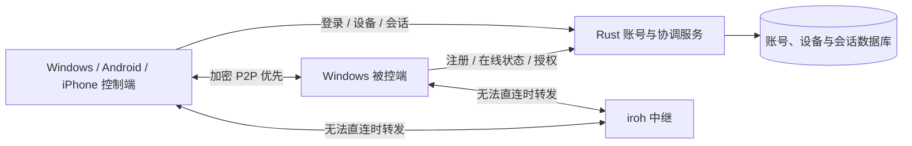

[English](PROJECT_DESIGN.md) | **简体中文**

<a id="farsail-remote-desktop-project-design-draft"></a>

# 遥舟：远程桌面项目设计草案

状态：设计草案，2026-09-28。尚未实现或验证性能。

<a id="name-and-positioning"></a>

## 名称与定位

- **中文名：遥舟；英文名：FarSail**。寓意驶向远方、跨越距离连接远端设备。
- 仓库与程序内部代号暂用 `farsail`。公开发布前再做正式商标与域名核查。
- 第一版产品范围：提供账号注册/登录、客户端设备注册绑定和账号/设备管理；登录后可查看同一账号下全部可远程设备，并发起远控或文件传输。Windows、Android 和 iPhone 作为控制端，Windows 作为被控端；跨网络远程查看与控制，优先使用 P2P 直连，不能直连时使用中继；支持多显示器、画质切换、带宽限制和双向文件传输。先验证账号、设备与 Windows 核心，再接入两个手机平台。
- 第一版采用临时邀请与被控端当次确认。无人值守访问、音频及 macOS/Linux 桌面端留给后续版本。用户已明确手机端第一阶段用于控制电脑，后续扩展手机作为被控设备；Android 与 iOS 的具体能力按系统接口分别交付。

<a id="icon-assets"></a>

## 图标资产

当前图标候选为 [FarSail v2](assets/branding/farsail-icon-master-v2.png)，采用抽象折帆、开放窗口和连接端点。原始图片及 Windows/Android/iOS 图标尺寸保存在 `assets/branding/`；首版双帆船因与已发现应用的整体视觉组合接近，作为历史草案保留。来源、生成提示词与有限范围的相似性检查见 [图标说明](assets/branding/README.zh-CN.md)。当前未宣称唯一性，尚未接入或发布客户端。

<a id="user-flow"></a>

## 用户流程

1. 用户注册并登录账号；客户端生成设备身份，首次确认后注册到服务器并绑定账号。在“我的设备”中显示名称、平台、控制/被控能力、在线状态和最近在线时间。
2. 控制端从自己的设备列表选择“远程控制”或“文件传输”；临时帮助别人时使用设备 ID 与短时邀请口令。被控端显示请求账号/设备、请求权限与验证短语，分别批准查看、控制或文件访问。绑定到同一账号仍沿用第一版当次确认策略。
3. 会话建立后显示连接方式（直连/中继）、延迟、码率、当前显示器与画质档位。控制端可以切换单屏或多屏总览。
4. 用户可以在远控中传文件，也可以只建立文件会话。被控端显示共享与传输状态，可分别撤销权限或结束全部连接。断线后会话授权失效，重新连接需再次确认；文件续传只复用已验证的内容进度，不复用失效授权。

<a id="architecture-and-boundaries"></a>

## 架构与边界



- **桌面程序**：Tauri 2 + TypeScript 前端负责界面；Rust 核心负责采集、编码、输入注入、会话状态和网络传输。Tauri 命令负责低频操作，Channel 负责高频数据/状态流；不把视频帧放进普通事件广播。
- **手机应用**：建议以 Tauri 2 的 Android/iOS 目标复用 Rust 会话与传输模块，触控界面单独适配。硬件解码与视频显示通过平台插件接入，Android 采用 Kotlin、iOS 采用 Swift。Tauri 移动构建、iroh 真机建连和原生视频视图组合须先做验证，再锁定移动技术栈；界面框架支持手机不代表视频性能已经达标。
- **账号与协调服务**：Rust 模块化单体，包含账号认证、设备注册绑定、在线状态、临时邀请、会话授权、管理接口和审计。建议使用 Axum + PostgreSQL，数据库保存归属与授权，在线连接由独立状态模块管理；初期无需拆成多个业务服务。它不接收屏幕画面或输入事件。
- **连接层**：首选 iroh 的加密 QUIC 连接。实际建连可先经过中继，随后探测并迁移到直连；直连失败时持续通过中继。中继部署为独立 Rust 服务，使用现成的 `iroh-relay`，避免自写 NAT 穿透协议。客户端明确显示当前路径。
- **身份**：用户账号标识所有者，客户端本地生成的长期设备密钥标识设备。服务器保存账号、设备公钥、绑定关系及短时地址信息，设备私钥留在本地安全存储。邀请口令一次性、短时有效；被控端对每次连接做本地确认。端到端连接身份与账号授权或邀请绑定，并显示双方可比较的验证短语，以发现首次配对时的身份替换。
- **版本边界**：网络协议带主/次版本号与能力协商，旧客户端只接收双方共同支持的分辨率、编码及输入能力。

<a id="account-management-and-client-registration"></a>

## 账号管理与客户端注册

<a id="user-and-administrator-features"></a>

### 用户与管理员功能

| 模块       | 第一版设计                                                                                                                     |
| ---------- | ------------------------------------------------------------------------------------------------------------------------------ |
| 账号       | 建议采用邮箱 + 密码注册/登录、邮箱验证、修改密码、找回密码、退出登录；服务端可配置公开注册或管理员邀请注册                     |
| 我的设备   | 展示同一账号下全部可远程设备；设备命名、平台和角色、在线/离线、最近在线时间、远控/文件能力、解绑；手机第一阶段以控制端角色注册 |
| 登录管理   | 查看登录会话与最近活动，踢出指定登录，退出其他设备登录；登录会话与已绑定设备分别展示                                           |
| 远控会话   | 列出当前连接与近期连接记录，发起请求、取消请求、主动断开，明确仅查看/允许控制权限                                              |
| 文件传输   | 从设备卡片独立发起或在远控中打开，双向传文件、显示进度、暂停/取消及授权后的断点续传                                            |
| 临时协助   | 登录用户可用短时邀请请求访问其他账号的设备；不改变设备归属。第一版控制端统一要求登录，匿名来宾另行设计                         |
| 管理员后台 | 管理用户启停、注册策略、邀请、设备撤销与会话审计；平台管理权限不会自动授予读取屏幕或控制设备的权限                             |

“后续无人值守”是独立的设备策略，不能因为账号相同或账号已登录就默认开启。需要在被控设备本地配置允许条件、可信控制端和更强认证，再单独验收。

<a id="device-list-for-the-same-account"></a>

### 同账号设备列表

- Windows、Android 和 iPhone 登录同一账号后，读取一致的服务端设备归属。默认列出全部具备被控或文件服务能力的已绑定设备，包含离线设备；离线或当前关闭远程访问的设备保留在列表中并注明原因。
- 按名称搜索、按在线状态和能力筛选；列表可分页，但不得仅返回近期连接或当前局域网内的设备。仅具备控制端角色的手机保留在登录/设备管理页，第一阶段不误标为可被远控手机。
- 设备卡片包含名称、平台、在线状态、最近在线时间和可执行操作。连接前重新校验在线状态及权限；缓存列表中的按钮不能替代实际授权。
- API 以当前登录身份筛选所有者，计数、搜索、分页和状态订阅均遵循同样边界。其他账号的设备 ID 不能用于读取其元数据；临时协助通过独立邀请流程授权。
- 解绑、禁用和设备状态变化同步到各端。退出/切换账号时清空该账号的界面缓存，防止旧账号设备列表留在新账号会话中。

<a id="registration-binding-and-going-online"></a>

### 注册、绑定与上线

1. 用户通过服务端认证获得当前登录会话；本地生成设备密钥对，私钥进入系统安全存储。所有者由服务端认证上下文确定，不信任请求体传入的 owner ID。
2. 服务端发出一次性设备注册挑战；客户端签名证明持有相应私钥，服务器验证后完成绑定。挑战绑定账号、操作、设备公钥和有效期，禁止重复消费。
3. 一个设备身份同一时间只有一个有效所有者。绑定写入使用数据库唯一约束与事务；重复注册请求幂等，其他账号不能仅提交相同设备 ID 覆盖归属。换账号需显式解绑/重新绑定流程；重装生成新身份时不自动继承旧权限。
4. 客户端获取仅用于自身上线、心跳和会话协商的设备凭据；它不能用于管理账号或列出其他设备。设备 ID 是标识符，不是密码；IP 和 NAT 地址属于可变的临时连接信息。
5. 在线状态由认证连接与心跳租约决定，超时显示离线；同一设备重连时用连接代次区分，新连接上线后旧连接的断开事件不能把新连接错误标成离线。

<a id="account-sessions-and-remote-control-authorization"></a>

### 账号会话与远控授权

- 登录会话采用短期访问凭据和可轮换、可撤销的刷新凭据；刷新令牌在数据库只保存验证所需的摘要。客户端凭据由 Rust/原生层管理，不放入 WebView localStorage。密码使用 Argon2id 加独立随机盐，参数在实现时按服务器资源与当前建议校准。
- 注册验证和密码恢复使用有期限、一次性的令牌，重置入口和登录入口有限速。修改密码、恢复账号、禁用账号等操作会撤销受影响的登录会话和远控授权；账号禁用还会禁止其设备继续更新上线与授权租约。
- 初期自有账号可通过 TLS 认证接口登录；后续接入第三方 OAuth/OIDC 时使用系统浏览器与 Authorization Code + PKCE，不在应用中嵌入长期客户端密钥。MFA/passkey 的接口与恢复状态预留到后续增强，不伪称已实现。
- 请求远控时，服务端检查账号状态、发起端/目标设备身份、绑定关系或有效邀请，以及目标设备当前策略；被控端再次检查，并进行本地批准。签发的短期授权绑定会话 ID、双方设备公钥、请求用户、权限、一次性随机量及期限。
- iroh 传输握手验证的是设备身份，账号权限在应用协议层额外验证。P2P 和中继两条路径执行相同授权检查，禁止绕过协调接口后直接凭已知 Endpoint ID 开始采集或注入输入。
- 活跃远控/文件授权以短租约续期；服务端撤权事件到达被控端后立即停止对应操作并结束相关会话。控制信道不可达时，不晚于本地授权租约到期停止共享、输入和文件读写，并释放按下的键；第一版优先保证撤销有界生效，不能让 P2P 连接无限期沿用旧权限。具体租约时长在实现时权衡短暂断网与撤权时效。
- “退出当前登录”清理该客户端凭据、上线状态及依赖它的远控会话，设备归属保留；“解绑设备”撤销该设备凭据、邀请和会话并移除有效绑定。重新加入必须再认证与验证设备持有权。服务端在每个接口检查权限，客户端隐藏按钮不能代替授权。

<a id="data-and-acceptance"></a>

### 数据与验收

建议的数据实体为 `users`、`auth_sessions`、`devices`、`device_credentials`、`invitations`、`remote_sessions`、`session_grants` 和 `audit_events`。账号角色、设备所有者、登录凭据、在线状态与远控权限各有明确归属；审计只记录主体、操作、对象、时间和结果，不包含密码、令牌、屏幕或按键内容。

验收覆盖：注册/邮箱验证/登录/找回密码；绑定挑战重放与并发重复绑定；两个账号互相访问设备接口的越权拒绝；在线心跳与重连代次；退出和解绑后旧凭据失效；禁用账号及撤权后 P2P/中继会话都停止；控制信道中断时的授权到期；管理员账号不能绕过被控端授权。邮箱服务为待部署依赖，尚未配置或发送邮件。

依据：[OWASP 认证](https://cheatsheetseries.owasp.org/cheatsheets/Authentication_Cheat_Sheet.html)、[密码存储](https://cheatsheetseries.owasp.org/cheatsheets/Password_Storage_Cheat_Sheet.html)、[会话管理](https://cheatsheetseries.owasp.org/cheatsheets/Session_Management_Cheat_Sheet.html)、[原生应用 OAuth](https://www.rfc-editor.org/info/rfc8252/)。以上仍为设计阶段方案。

<a id="windows-display-and-control"></a>

## Windows 画面与控制

- 使用 DXGI Desktop Duplication 作为首选屏幕采集接口。每个显示器独立采集，记录系统坐标、实际像素尺寸、旋转和 DPI。采集接口抽象在 Rust 核心中，方便以后接入 macOS/Linux 实现。
- 编码分两步：连通性原型可用 JPEG 帧验证端到端链路；首发视频方案同时验证 H.265/HEVC 与 H.264，优先使用两端可稳定运行的 H.265 硬件编码/解码，H.264 负责兼容回退。AV1 作为能力适配后的增强候选，达到实时延迟与功耗目标后才启用。Windows 先验证 Media Foundation 可枚举的编码器，必要时为厂商硬件编码后端增加独立适配；不假设所有机器都具备同样的编码器。编码器切换和采集丢失都要在界面显示原因。
- 使用系统编码器的帧间压缩与 DXGI 变化区域信息减少静态桌面的重复数据；文字和细线区域优先保证可读性。每块屏幕有独立的视频流和序号，接收端只显示最新完整帧。输入事件走独立的可靠流，不与视频帧共用队列。
- 每帧携带会话/屏幕 ID、序号、时间戳、编码格式、关键帧标记和长度。接收端校验协议版本与帧长度，只把完整、可解码的帧交给解码器；坏帧或参考帧缺失时跳过并请求新的关键帧。压缩由标准编解码器完成，不自创图片压缩格式。
- 控制端根据显示器的原始坐标和当前缩放比例映射鼠标位置。多屏负坐标、不同 DPI、旋转及显示器热插拔必须作为单独测试用例。输入使用 Windows 系统接口注入，服务端只接受已授权会话的白名单事件；断线时释放仍按下的键与鼠标键。
- 第一版运行在当前登录用户的交互桌面中。锁屏、UAC 安全桌面和无用户登录场景需要独立的系统服务与权限方案，不纳入第一版交付。

<a id="codec-selection-h265-as-the-primary-candidate-av1-as-an-enhancement"></a>

## 编码选择：H.265 为主要候选，AV1 为增强候选

这是基于官方资料的设计建议，尚无遥舟自身的设备实测结果。

完整候选范围及官方来源见 [视频与桌面画面编码全景调研](CODEC_SURVEY.zh-CN.md)，包含 AV2、VVC、EVC、LCEVC、AVS、专业/无损编码和静态图像方案。AV2 已发布正式规范，但遥舟尚未验证其目标设备实时链路。新标准的成熟度与设备实际可用能力分别记录。

| 编码       | 对本项目的价值                                                | 采用条件                                                                 |
| ---------- | ------------------------------------------------------------- | ------------------------------------------------------------------------ |
| H.264/AVC  | 兼容回退与首条视频链路基线                                    | 选择双方可用的 profile/level；软件回退也必须满足降低分辨率后的实时预算   |
| H.265/HEVC | 在相近视觉质量下通常可比 H.264 减少数据量，适合高清和多屏预算 | 被控端硬编码、控制端硬解码及相应分辨率/帧率都通过验证时优先使用          |
| AV1        | 有进一步降低码率的潜力；适合双方拥有相应硬件能力的组合        | 与 HEVC 在同一桌面样本、画质及低延迟约束下比较后启用，不仅凭格式名称排序 |

- 压缩效率、解码正确性和解码速度是不同指标。标准编码可以正确解码，不代表任意手机都能实时解码任意 profile、位深、分辨率和多路视频。每路会话协商 codec、profile、level、位深、色度采样、输出尺寸和帧率，并校验整机多路吞吐预算。
- 初期采用 SDR、8-bit、4:2:0 作为兼容基线，同时将“文字清晰 / 4:4:4”列为正式画质功能目标，按下节条件启用；HDR 独立规划。彩色小字和细线要人工检查，不能用“1080p”或视频质量分数代替桌面文字可读性。静止桌面优先保留清晰度并降低更新频率，滚动/动态画面优先维持操作响应。
- 采用低延迟设置：限制或关闭前瞻与帧重排，首轮以无 B 帧配置建立延迟基线；CBR/受限码率、短缓冲、发送节流共同控制突发。具体参数逐个检查编码器是否支持，不将离线压缩预设用于远程操作。
- 编码器的目标平均码率不等于网络瞬时上限。关键帧、多屏同时刷新和重传都需要计入预算，发送层按有限突发窗口整形，给输入与心跳预留资源。带宽不足时降低产生帧的速度，不无限积压。
- 已编码的视频默认跳过第二次通用压缩；对原始图块等仍有冗余的数据增加选择性的传输前无损压缩，具体见“传输数据的无损压缩层”。是否启用以实际字节收益和新增延迟共同决定。
- 在视频基线之后单独实验内容适配：动态画面走视频编码，静态文字/图标评估无损小图块、变化区域与缓存。混合模式必须解决版本、区域归属和合成顺序，并把合成开销计入总预算；实测优于纯视频后才启用，不能仅凭压缩文件大小判定。
- 编码切换时发送新的参数集/配置和配置版本，接收端准备好后从可独立解码的关键帧开始。初始化失败或持续解码超时时回退已验证配置，并设置冷却时间避免反复切换。
- 验证材料包含静态文字、彩色细字、网页滚动、窗口拖动、视频播放和多屏。固定输入、缩放、帧率和低延迟预算，比较相近可读性下的实际码率、编码/解码耗时分位数、显示延迟、掉帧、内存和手机温升耗电；不以相同 CRF/QP 数值跨编码器比较，也不直接采用厂商视频样本的节流百分比作为产品承诺。

依据：Apple 说明 HEVC 相比 H.264 可在相同视觉质量下提高压缩效率；NVIDIA 的指定硬件测试展示了 AV1 的效率潜力，结果受编码器和素材影响。Windows HEVC 接口提供低延迟、码率和关键帧控制。Android 格式支持表与 Apple 硬解能力接口用于初筛，最终仍要实际创建解码会话并测试。

<a id="clear-text-and-444-mode"></a>

## 文字清晰与 4:4:4 模式

目标是实现同类产品展示的完整色度采样能力，改善彩色文字、细线和图标边缘；尚未验证与任何特定商业产品的画质、性能一致。4:4:4 不等于像素无损，也不等于 HDR。

| 路径            | 实现要求                                                                                          | 产品标识                                                         |
| --------------- | ------------------------------------------------------------------------------------------------- | ---------------------------------------------------------------- |
| 原生 4:4:4 视频 | 捕获 RGB/BGRA 后保留完整色度，使用双方支持的 4:4:4 编码 profile，并通过原生解码与渲染保留到显示前 | 真正启用并验证后显示“4:4:4”                                      |
| 分拆色度后重建  | 参考 AVC444 思路，将完整色度信息打包进主画面和辅助画面，利用 4:2:0 解码器后在 GPU 合成            | 实验性“4:4:4 重建”；验证覆盖范围、量化误差、多路解码成本后再交付 |
| 局部文字增强    | 4:2:0 视频搭配受版本管理的无损文字/图块更新                                                       | 显示“文字增强”，不能称为全屏原生 4:4:4                           |

- 优先验证 Windows→Windows 的原生 HEVC 4:4:4 路径。检测 profile、像素格式、位深和实际吞吐；普通 HEVC Main/Main10 支持及接收 RGB 输入都不能证明码流是 4:4:4。必要时接入厂商编码后端，不能假设通用 Media Foundation HEVC Main 编码器满足要求。
- Android/iPhone 控制端逐台检测并实测对应 profile；仅查询“支持 HEVC 硬解”不足以启用 4:4:4。没有合适硬解路径时评估重建或文字增强，保留 4:2:0 基线。手机多屏需把每块屏幕的辅助画面也计入并行解码和带宽预算。
- 采集与色彩转换阶段不得先转成 NV12/4:2:0 再插值冒充 4:4:4；丢失的原始色度不能靠改标签恢复。协议与渲染端明确色彩基色、传递函数、转换矩阵和 full/limited range，防止偏色、灰黑和泛白。
- 画质选择与分辨率/帧率分开：用户可选“自动”“文字清晰”“流畅省流”，状态显示实际色度模式。文字清晰优先降低刷新率、减少非活动屏幕更新以保留细节；仍超预算时回退并显示实际状态，避免后台降为 4:2:0 后继续标称 4:4:4。
- 验收使用 1 像素彩色细线、红蓝小字、代码、表格、色条和灰阶，同时检查未缩放解码输出及原生比例显示。记录输出色度、编码损伤、色彩转换误差与缩放影响；对照 4:2:0，验证切档、限速、多屏、重建画面对齐及手机温升。分拆重建与局部增强仍是独立验证项。

参考：[NVIDIA 编码配置](https://docs.nvidia.com/video-technologies/video-codec-sdk/13.1/nvenc-video-encoder-api-prog-guide/index.html)、[NVIDIA HEVC 4:4:4 硬解能力](https://docs.nvidia.com/video-technologies/video-codec-sdk/13.0/nvdec-application-note/index.html)、[Microsoft AVC444 的双 4:2:0 重建](https://learn.microsoft.com/en-us/openspecs/windows_protocols/ms-rdpegfx/8131c1bc-1af8-4907-a05a-f72f4581160f)。

<a id="quality-multiple-monitors-and-rate-control"></a>

## 画质、多屏与速率控制

这些数值是初始档位上限，不是未经测试的性能承诺；编码能力与网络测量会决定实际输出。

| 档位         | 单屏输出上限           | 帧率上限 | 单屏目标码率上限 |
| ------------ | ---------------------- | -------: | ---------------: |
| 流畅         | 1280 × 720             |   30 fps |           3 Mbps |
| 均衡（默认） | 1920 × 1080            |   24 fps |           5 Mbps |
| 清晰         | 2560 × 1440            |   20 fps |          10 Mbps |
| 自定义       | 不超过显示器原生分辨率 | 5–60 fps |      0.5–20 Mbps |

- 画质可在会话中切换，不需要重新配对。每块显示器可选档位，也可设置会话总码率上限；总上限优先于单屏设置。
- 支持“单屏”“逐屏切换”“多屏总览”。多屏总览时当前操作的屏幕优先获得码率与帧率，其他屏幕可降帧；用户也能为某块屏幕固定质量。
- 自适应输入是 RTT、实际吞吐、丢包、帧编码耗时、发送队列长度和接收端显示延迟。先降帧率/分辨率或码率，再按恢复条件逐步升档；不让旧帧排队。
- **防卡死约束**：会话总发送速率有硬上限，按实测可用带宽留余量；视频发送队列最多保留少量待发帧，采集与编码前就做节流。连接层保留输入控制和心跳的优先级。网络拥塞时暂停低优先级屏幕或降低其更新频率，不能靠无限缓存维持表面帧率。
- **解码恢复约束**：优先在编码之前丢弃过期采集帧；已编码参考帧不能随意删除后仍继续使用其依赖链。参考帧丢失或过期后，停止提交依赖它的帧，并从参数配置及新的独立关键帧恢复；对关键帧请求限流，避免拥塞中反复制造码率峰值。切换分辨率/编码格式时先通知解码器重建，再恢复显示；保留上一张有效画面并提示恢复状态。
- 高清是可选档位而非固定占满带宽。动态画面、多个高分辨率显示器和弱网同时出现时，优先守住操作响应与画面新鲜度，清晰度会按总带宽预算下降。
- 中继路径的带宽会产生成本，服务端记录会话级转发流量和失败原因，不记录画面内容。界面明确标出中继状态与实时速率。

<a id="combined-approach-to-reducing-bandwidth"></a>

## 减少带宽的组合方案

在满足操作延迟和画质要求的前提下，先减少必须传输的画面数据，再压缩，最后按总预算调度。压缩在被控端加密之前完成，控制端解密后解码；中继保持密文转发。

| 方法                  | 具体行为                                                                                                      | 实施阶段           |
| --------------------- | ------------------------------------------------------------------------------------------------------------- | ------------------ |
| 静止画面停止重复发送  | 初次完整更新后，画面无变化时暂停生成重复视频帧；保留心跳，采集变化事件可唤醒编码；重连/解码重置仍发送恢复画面 | 视频基线阶段       |
| 视频帧间压缩          | 动态画面使用低延迟 HEVC/H.264，支持设备实验 AV1；利用跨帧预测减少重复信息                                     | 视频基线阶段       |
| 鼠标单独传输          | 系统提供独立指针时缓存其形状，只传坐标/可见性/形状变化；已绘入采集画面的指针按画面处理，避免重复绘制          | 视频基线阶段       |
| 多屏按需更新          | 当前操作屏幕优先；其他可见屏幕根据模式降帧，隐藏屏幕暂停视频或只发送低频预览；总览所有屏幕共享预算            | 多屏阶段           |
| 变化图块和移动区域    | 只发送修改的小区域；接收端已有有效基底时，窗口移动等可发送区域复制指令及新露出内容                            | 视频基线后独立实验 |
| 文字/动态图像分别压缩 | 小块文字/图标比较 PNG、无损 WebP 等；大范围连续变化使用视频；选择时计算编码/解码与合成时间                    | 与混合模式一起实验 |
| 静止后补清晰细节      | 拖动/滚动期间优先新画面，停稳后按剩余带宽补充对应版本的清晰图块；高优先级新画面可取消尚未发送的旧增强任务     | 混合模式验证后     |

- Windows 的 dirty/move 元数据可帮助识别变化；在纯视频路径中先用于跳过重复帧、指导更新，不把任意裁剪块直接拼接成标准视频码流。视频编码器本身已有帧间预测，不能把这些方法的收益简单相加。
- 图块/移动/缓存引用必须绑定会话、显示器、布局版本、画面代次和接收端已确认基底。只在有限容量的本会话缓存中引用；首次连接、丢失基底、切分辨率或切换模式时请求完整重建。无损图块与有损视频的重建结果分别管理，不能把原始像素相同误当成接收端缓存必然相同。
- 图块和视频更新约定同一画面的合成顺序，过期图块不得覆盖较新画面；传输丢失后依赖不满足的更新不能继续套用。解码前限制尺寸、图块数量及解压后内存，队列和缓存均有明确上限。
- 不用有损预处理破坏准备走 4:4:4 的原始颜色信息。文字清晰模式先减少重复刷新与非活动屏幕负载，必要时降帧；动态图像模式优先操作响应。像素无损区域和视觉近似的视频在状态与验收上分别说明。
- 网络调度将视频、辅助色度、清晰化图块、恢复关键帧和协议开销统一计费。输入与心跳优先，增强画面使用剩余预算；以有界突发窗口限制发送速率，并参考传输层实际字节和拥塞状态调整编码目标。P2P 可减少中继负载，但不会自动减少相同码流在两端的流量。
- HEVC/AV1 等已压缩码流默认直通传输前压缩层；可压缩的原始数据按下节策略处理。主视频流采用二进制传输，避免 Base64 的额外体积和转换开销。

验收比较“同一编码器的普通视频基线”与“启用各项优化”的结果，逐项记录：静止桌面、打字、鼠标移动、网页滚动、拖动窗口、全屏视频、双屏和限速场景的实际线上字节、文字质量、端到端延迟、CPU/GPU、缓存峰值及手机耗电。收益必须在相近画质和延迟约束下成立，不预先承诺固定压缩倍数。

依据：[Windows 变化区域、移动区域与独立鼠标信息](https://learn.microsoft.com/en-us/windows/win32/direct3ddxgi/desktop-dup-api)、[Microsoft 远程桌面混合编码](https://learn.microsoft.com/en-us/azure/virtual-desktop/graphics-encoding)。上述组合为 FarSail 的待实现方案，尚未产生性能数据。

<a id="lossless-compression-layer-for-transport-data"></a>

## 传输数据的无损压缩层

此层处理准备发送的应用消息字节，独立于视频编码。它在交给 iroh/QUIC 加密前按块执行，接收端先解密、解压，再解析图块或视频；不要求中继解密，不在已加密网络包上继续压缩。

```text
画面/控制等数据 → 内容编码与序列化 → 可选 Zstd/LZ4 → 加密传输
对端处理       ← 内容解码与解析   ← 按块无损解压 ← 解密接收
```

| 数据类型                                    | 拟定传输压缩策略                                                                                       |
| ------------------------------------------- | ------------------------------------------------------------------------------------------------------ |
| 原始 RGB/YCbCr 图块、适用的原始差分数据     | 用 Zstd 低等级/快速模式做首选实验；与无压缩和 LZ4 比较体积及延迟，源字节可精确恢复                     |
| 较大的结构化元数据                          | 序列化后按大小和实测可压缩性决定；不为凑压缩块延迟关键消息                                             |
| H.264/H.265/AV1、JPEG/PNG/WebP 等已编码负载 | 默认不再次压缩；若样本测试显示有足够额外收益且延迟达标，再针对具体类型配置，不能假设所有视频都还能缩小 |
| 鼠标、按键、心跳和认证消息                  | 默认不压缩，避免处理与包头成本及等待；输入响应优先                                                     |
| 文件传输                                    | 复用分块无损压缩；文本类文件尝试 Zstd，已压缩文件按可压缩性跳过；压缩前后的完整性校验分别处理          |
| 后续剪贴板扩展                              | 可复用分块压缩能力，按后续功能范围验收                                                                 |

- Zstd 面向快速无损压缩并允许调节速度与压缩率；LZ4 作为优先速度的比较对象。第一步只选实测合适的一种主算法，不为了完整列表同时实现所有库。
- 每块独立压缩与解压，不等待整段会话结束，不把图像、输入和认证数据放进一个持续增长的压缩上下文。协议协商 `none/zstd`，只有实现并验证 LZ4 后才公布 `lz4` 能力；未协商的算法直接拒绝。
- 消息包头包含版本、消息类型、压缩方法、压缩前长度与负载长度。初版不依赖跨消息字典；以后如引入固定字典，必须协商字典 ID 并提供无字典回退。数据分块与底层网络包边界分开。
- 只有压缩后节省的字节足以覆盖新增包头、且编解压耗时符合预算，才发送压缩结果；否则发送同一消息的原始负载。连续低收益的类型进入直通状态，避免反复耗费 CPU。任务进入压缩前检查期限，使用受限块大小与后台工作线程控制耗时，不能阻塞输入处理。
- 无损压缩恢复的是“进入这一层的原始字节”，不会额外降低画质；若其输入已经是有损视频，它不会恢复此前丢失的像素。对正确的压缩流应精确往返，损坏或长度不符时拒绝交付给内容解码器。
- 解压前校验最大原始长度、压缩窗口和总内存预算，禁止依据对端声明无限分配内存。连接中断后丢弃不完整块；图像依赖恢复仍按画面协议处理。
- 验收同时记录内容编码前字节数、内容编码后字节数、外层压缩后字节数、线上总流量、压缩/解压耗时分位数、CPU 和内存。测试纯色图块、文字图块、噪声图块及真实 HEVC/AV1 数据；不得将视频编码收益算成外层压缩收益。

参考：[Zstandard 官方实现](https://github.com/facebook/zstd)、[LZ4 官方实现](https://github.com/lz4/lz4)。外层压缩是一项待实现的协议能力，目前没有本项目的实测收益数据。

<a id="bidirectional-file-transfer"></a>

## 双向文件传输

<a id="product-behavior"></a>

### 产品行为

- 第一版覆盖 Windows↔Windows、Android↔Windows、iPhone↔Windows 的文件上传与下载；支持单个和多个文件任务。用户可从设备卡片直接进入文件传输，也可在已有远控会话中打开传输面板。
- 文件会话与屏幕/输入权限独立：仅传文件无需启动屏幕采集，批准远控也不会自动允许任意文件读取。关闭远控窗口时，如有独立授权的文件任务继续执行，界面明确显示；“结束全部连接”、退出登录或撤权停止所有相关任务。
- 被控端批准当前文件会话的读取/写入权限及允许的文件/目录范围，授权有效期间可以在该范围内操作。Windows 控制端可显示本地文件和已授权远程目录；手机用系统文件选择器选择上传文件或下载保存位置。
- 传输面板显示文件名、方向、目标设备、已确认进度、实际速率、预计剩余时间与状态，支持暂停、继续、取消和失败重试。同名文件默认保留两份或询问，不静默覆盖。文件夹整树同步与镜像删除另行设计。

<a id="data-and-recovery-flow"></a>

### 数据与恢复流程

1. 通过账号/设备授权创建传输任务，绑定双方设备、方向、允许的目标位置、源文件版本、长度及任务 ID；随后协商分块参数和可选无损压缩。
2. 文件内容通过 iroh 加密连接的独立可靠流分块传输，P2P 与中继沿用相同协议。协调服务只保存必要会话元数据，不保存文件正文；中继转发密文。
3. 接收端分块解压并写入独立临时文件，保存已验证进度。使用如 SHA-256 的内容摘要验证块和最终完整文件；授权保护与加密完整性仍由会话及传输协议承担，摘要不是授权凭据。
4. 大文件按流式处理，限制在途块数和内存，不把整个文件读入内存。断线后重新授权，只续传同一源版本且已校验的缺失部分；源文件发生变化时重新建任务，避免不同版本拼接。
5. 完整性检查通过后，在支持的本地文件系统中以同卷临时文件提交到最终位置，并获得对端提交确认后才显示完成。手机文档提供器不保证同样的原子改名能力时，先本地校验再按系统接口导出，以导出成功为完成状态。校验失败、磁盘不足或取消均不把半成品当成最终文件。

<a id="bandwidth-paths-and-authorization-boundaries"></a>

### 带宽、路径和授权边界

- 文件任务复用传输前 Zstd 选择性压缩：压缩结果无收益时直通，解压后字节须与源内容一致。ZIP、视频等已有压缩格式默认跳过二次压缩。
- 文件、画面和辅助画面共同受会话总预算约束；多会话还受本设备总预算约束。调度优先级为输入/心跳、交互画面、后台文件；存在文件任务时按实际 RTT/排队情况主动降速。仅分成不同 QUIC 流并不能保证互不争抢带宽，因此需应用层限速与背压；文件独立限速可由用户设置。
- 远程目录和目标文件使用受授权约束的句柄/资源 ID；所有路径在读写端校验，不信任控制端给出的绝对路径。覆盖、路径穿越、Windows 重解析点/目录联接、替换竞态及解压后空间预算都要验证。文件按数据接收，不自动打开或执行。
- Android 使用系统文档选择授权，iPhone 使用文档选择器及系统授予的文件访问范围；不把手机沙盒外任意路径当作可自由读写的磁盘。进入后台/进程被系统回收时持久化可恢复进度；首版不承诺手机后台持续传输。
- 审计记录账号、设备、方向、大小、时间与结果，文件内容不进入服务器日志；本地任务记录按账号隔离，敏感完整路径不写公共诊断日志。恢复任务必须再次验证当前账号和权限。

验收包含：同账号设备全量列表及跨账号隔离；仅文件会话和远控中传输；双向、多文件、空文件、大文件与中文名称；限速时的鼠标响应；压缩往返；断线续传与源文件变化；取消/磁盘满/校验失败；同名冲突、路径越界与权限撤销；Android/iPhone 真机文件选择、导出和后台恢复。

来源：[Android 文件选择与授权](https://developer.android.com/training/data-storage/shared/documents-files)、[Apple 文档选择器](https://developer.apple.com/documentation/uikit/uidocumentpickerviewcontroller)、[文件名与覆盖边界](https://cheatsheetseries.owasp.org/cheatsheets/File_Upload_Cheat_Sheet.html)。这里的选择、权限和恢复行为是设计目标，尚未实现。

<a id="mobile-controllers-android--iphone"></a>

## 手机控制端（Android / iPhone）

<a id="interaction-and-multiple-monitors"></a>

### 操作与多屏

- 手机与桌面使用同一套设备 ID、邀请、被控端确认及权限撤销流程。控制端支持直接触点定位和触控板两种操作模式；提供点击、拖拽、右键、滚轮、双指缩放、横竖屏切换及常用组合键工具栏。
- 中文等输入法以完成组合后的文本提交，物理按键和组合键单独传输，避免把输入法中间状态重复发送到电脑。弹出软键盘后保留可操作画面和断开按钮。
- 多屏采用显示器列表与总览缩略图，点击进入某一屏；放大和平移改变本地视口。坐标映射同时考虑原始显示器尺寸、画面缩放、留黑区域、手机旋转和本地视口，输入携带显示器 ID 与布局版本，拒绝过期布局下的操作。

<a id="video-networking-and-resource-budgets"></a>

### 视频、网络与资源预算

- 手机复用 Rust 的会话和 iroh 传输模块，视频通过平台原生解码/显示通路处理。候选为 Android MediaCodec 和 iOS VideoToolbox；在真机上验证解码延迟、原生画面与 Tauri 界面叠加以及旋转生命周期。避免逐帧将解码后的像素转成 JSON/Base64 送进 WebView。
- 建连时报告 H.264、H.265 及可用 AV1 的 profile/level、位深、最大分辨率、像素处理速率和并行解码数量，Windows 根据双方共同能力编码。格式“支持”与“硬件加速”分别记录，不仅根据 Android/iOS 版本推断。手机能力不足时自动减少同时播放的屏幕数量，以低频缩略图保留其余屏幕入口。
- 增加“自动”“省流”“高清”预设与独立的蜂窝网络总码率上限。手机仍遵守会话总预算；默认优先活动屏幕，隐藏屏幕停止持续全分辨率传输。展示当前速率及本次流量，用户可手动切换清晰度。
- 自适应还需参考解码队列、持续掉帧及可获取的温度/电源信号，避免网络足够时仍因手机解码能力、发热或耗电而卡顿。清晰度切换必须协商参数、更新解码器并从关键帧恢复。
- Wi-Fi 与蜂窝网络切换时检测路径变化并尝试恢复传输；失联立即释放被控端按键，撤销旧会话输入许可，新会话重新授权。手机进入后台或锁屏时暂停视频订阅和输入，配合被控端心跳超时清理，不能依赖手机后台回调一定执行。
- 设备身份凭据使用平台安全存储保护；限制 WebView 来源与桥接能力。iOS 的构建、签名和真机验证需要 macOS/Xcode 环境，不能以 Windows 上的前端预览代替 iPhone 验收。

<a id="future-mobile-controlled-devices"></a>

## 后续手机被控端

| 方向                   | 后续计划                                             | 验证边界                                                                                                                     |
| ---------------------- | ---------------------------------------------------- | ---------------------------------------------------------------------------------------------------------------------------- |
| 电脑或手机控制 Android | 先屏幕共享，再接入经用户授权的点击、滑动、返回等操作 | MediaProjection 每次采集授权；输入通路需核对适用公开 API、用途要求、发行规则及厂商兼容性；无输入能力时退化为仅查看           |
| 电脑或手机协助 iPhone  | 先实现系统允许的屏幕共享与远程指导                   | 完整系统级触控列为能力研究项，尚无已验证的通用第三方实现路径；以目标 iOS 版本公开接口为准，不预先承诺与 Android 同等控制能力 |

- 将设备角色（控制端/被控端）与平台解耦，协议通过能力集声明屏幕查看、鼠标键盘、触摸、文本输入及系统导航。申请权限和执行指令时均验证能力，不把 Windows 的输入模型硬套到手机上。
- 新的采集与输入实现接入独立平台模块，复用已有加密传输、配对、带宽预算和错误恢复。界面只展示对端实际支持的功能，权限撤销立即生效。
- Android 被控原型先覆盖少量明确机型；iPhone 先验证系统授权后的共享。两者独立验收，不能以模拟器或一台手机的结果代表全部平台。

<a id="security-and-privacy-baseline"></a>

## 安全与隐私基线

- 默认不开启无人值守控制；每次连接由被控端批准，并可单独授予查看或控制权限。
- 会话授权绑定两端设备身份、权限、过期时间和唯一会话 ID。口令设有效期、一次性消费和错误尝试限制。
- 图像与输入通过端到端加密连接传输；协调服务和中继不能解密会话内容。服务端仍需 TLS、访问限制、限流与日志脱敏。
- 被控端持续显示共享指示和紧急断开入口。结束连接后立即停止采集、撤销输入权限并清理会话状态。
- 日志只保留连接状态、路径、码率、延迟和错误码；不记录屏幕帧、按键内容、口令或长期密钥。

<a id="suggested-repository-structure"></a>

## 仓库建议结构

```text
apps/desktop/           Tauri 2 桌面程序与 TypeScript 界面
apps/mobile/            Tauri 2 Android/iOS 手机控制端（待真机技术验证）
packages/ui/            共享的界面组件与协议类型
crates/core/            会话、协议、画质策略与平台无关接口
crates/windows/         DXGI 采集、Media Foundation 编码、输入注入
crates/transport/       iroh 连接、直连/中继状态与流复用
crates/file-transfer/   文件会话、分块压缩、校验、续传与限速
plugins/mobile-media/   Kotlin/Swift 原生解码、视频视图和生命周期适配
plugins/mobile-files/   Android/iOS 文件选择、授权读取和导出适配
services/coordinator/   Rust 账号、设备、会话与协调服务
apps/admin/             账号与设备管理后台
deploy/relay/           iroh-relay 配置与部署文件
docs/                   协议、威胁模型、测试记录
```

<a id="implementation-order-and-acceptance"></a>

## 实施顺序与验收

1. **账号、设备与网络验证**：先完成注册登录、设备持有权证明/绑定、在线状态与管理撤销，再由两台 Windows 电脑通过自建协调服务和中继建立端到端加密连接；显示实际路径，并在不同网络中证明直连与强制中继都能通信。验证跨账号隔离、拒绝、口令过期、重复使用，以及 P2P 建连后的撤权生效。
2. **单屏远程控制**：采集一块显示器，发送画面，完成鼠标、键盘和滚轮操作；被控端确认、暂停和结束连接均有效。先用 JPEG 验证正确性，再完成 H.264 基线与 H.265 硬编/硬解及回退验证；支持 AV1 的组合另行对比。
3. **多屏与画质**：可切屏和多屏总览；会话中切换档位与总带宽上限；完成支持设备的原生 4:4:4、色彩正确性和 4:2:0 回退验证。验证负坐标、不同 DPI、显示器拔插、断线恢复、旧帧丢弃、损坏帧拒绝及关键帧恢复。限速网络下验证输入仍可响应，发送队列不持续增长。
4. **文件传输**：先验证 Windows 双向文件传输、独立文件会话、授权范围、分块压缩、完整性、续传及取消；在远控同时运行时验证总带宽预算和交互延迟。
5. **手机控制电脑**：Android 与 iPhone 真机分别验证建连、原生解码、触控映射、中文输入、多屏切换、画质调整和双向文件选择/导出；覆盖 Wi-Fi/蜂窝切换、后台/锁屏、低性能手机、解码失败、持续使用时发热耗电与流量上限。
6. **发布前验证**：在至少两种不同运营商/NAT 网络上实测直连率、回退时间、RTT、FPS、实际码率、CPU/GPU 占用与端到端操作延迟；修复权限、安装与崩溃恢复问题后再制作各端安装包。
7. **后续手机被控**：先完成 Android 授权共享及输入可行性原型，再扩展机型；iPhone 独立验证屏幕共享，并审查是否存在满足产品用途的公开远程输入能力。

<a id="design-references"></a>

## 设计依据

- [Tauri 2 架构](https://v2.tauri.app/concept/architecture/)；[Tauri Channel 与事件的适用范围](https://tauri.app/develop/calling-frontend/)。
- [iroh 连接、直连迁移和中继机制](https://docs.rs/iroh/latest/iroh/)。
- [Windows Desktop Duplication API](https://learn.microsoft.com/en-us/windows/win32/direct3ddxgi/desktop-dup-api)；[Windows SendInput](https://learn.microsoft.com/en-us/windows/win32/api/winuser/nf-winuser-sendinput)。
- [Tauri 移动插件](https://v2.tauri.app/develop/plugins/develop-mobile/)；[移动构建环境](https://v2.tauri.app/start/prerequisites/)。
- [Android MediaProjection 授权](https://developer.android.com/media/platform/av-capture)；[Android 手势注入接口与用途说明](https://developer.android.com/reference/android/accessibilityservice/AccessibilityService)。
- [Apple 视频解码](https://developer.apple.com/documentation/videotoolbox/vtdecompressionsession-api-collection)；[Apple 屏幕共享接口](https://developer.apple.com/documentation/screencapturekit)；[iOS 应用运行时权限边界](https://support.apple.com/en-nz/guide/security/sec15bfe098e/web)。
- [Apple HEVC 与 H.264 的效率说明](https://support.apple.com/en-ae/116944)；[NVIDIA AV1 硬件编码对比](https://developer.nvidia.com/blog/?p=59492)；[NVIDIA 编码预设与延迟权衡](https://developer.nvidia.com/blog/introducing-video-codec-sdk-10-presets/)。
- [Windows HEVC 编码接口](https://learn.microsoft.com/en-us/windows/win32/medfound/h-265---hevc-video-encoder)；[Android 格式支持](https://developer.android.com/media/platform/supported-formats)；[Android 编解码器能力](https://developer.android.com/reference/android/media/MediaCodecInfo)；[Apple 硬解能力查询](<https://developer.apple.com/documentation/videotoolbox/vtishardwaredecodesupported(_:)>)。
